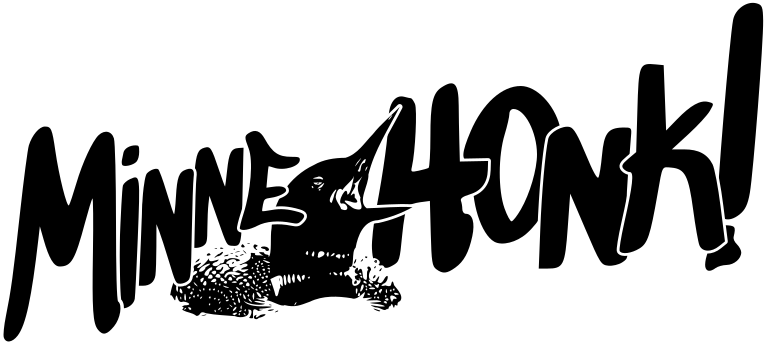

---
# Feel free to add content and custom Front Matter to this file.
# To modify the layout, see https://jekyllrb.com/docs/themes/#overriding-theme-defaults

title: MinneHONK! 2026
layout: default
---

# MinneHONK!

<h2 style="text-align: center;">MinneHONK! 2026 May 1st - 3rd</h2>

MinneHONK! is back for the first weekend of May in 2026!

Join us for a festival of activist street bands from Minneapolis and across the country, with free and open-to-the-public performances on Friday, May 1st at Arbeiter Brewing; Saturday, May 2nd at George Floyd Square; and Sunday, May 3rd at the Powderhorn Park Mayday parade and festival.

## Featuring
[**Brass Liberation Orchestra**](https://brassliberation.org) • *Bay Area, CA* 
[**Brass Messengers**](https://www.brassmessengers.com/about) • *Minneapolis, MN* 
[**Brass Solidarity**](https://brasssolidarity.com) • *Minneapolis, MN* 
[**Extraordinary Rendition Band**](https://www.extraordinaryrenditionband.com/) • *Providence, RI* 
[**Forward! Marching Band**](https://forwardband.org) • *Madison, WI* 
[**Good Trouble Brass Band**](https://www.goodtroublebrassband.org) • *Somerville, MA* 
[**Kapulli KetzalCoatlique**](https://www.danzaketzal.com/history) • *Minneapolis, MN* 
[**Unlawful Assembly**](https://unlawfulassembly.org) • *Minneapolis, MN* 

## Schedule
### Friday, May 1
* **International Workers' Day March** Join with your neighbors and fellow workers—and musicians from Unlawful Assembly and Brass Liberation Orchestra!—to demand ICE out of our communities and legalization for all people. *March begins 4:30pm at Lake Street and Chicago Ave ([more info](https://unidos-mn.org/events/2026/5/1/may-day-2026))*
* **MinneHONK! Eve** Head down the street after the march to kick off MinneHONK! weekend with a round of short performances and a jam session. *6pm to 9pm at Arbeiter Brewing and Moon Palace Patio*

### Saturday, May 2
* **George Floyd Square Community Cleanup** Help out a neighborhood cleanup effort and repainting of the mourning passage in preparation for the 2026 [Rise and Remember Festival](https://riseandremember.org/events/rise-remember-festival/) later in May. *Begins 9am on 3700 block of Chicago Ave*
* **MinneHONK! Opening Ceremony** *10:30am at Say Their Names Cemetery*
* **MinneHONK! Performances** Stages at the People's Way (38th St and Chicago Ave) and the Northern Fist (37th St and Chicago Ave). *Noon to 4:30pm*
* **Communal Jam** Open to all bands and all members of the community. *4:30pm at the People's Way*

### Sunday, May 3
* **Mayday Parade** Catch several MinneHONK! bands playing in the parade, among the many other spectacles it has to offer. *Parade steps off at noon from Bloomington Ave and 28th St ([more info](https://www.maydaympls.org/parade))*
* **Tree of Life Ceremony** Experience a celebration of the joy and resilience of community with dance, theater, music, and puppets. *Ceremony follows parade (approx 3pm) at east side of Powderhorn Lake ([more info](https://www.maydaympls.org/ceremony))*
* **MinneHONK! Performances** The bands will bring more music of resistance, liberation, and joy to the park after the ceremony. *Following ceremony (approx 4:15pm) on south side of Powderhorn Lake*

## Get Involved!
MinneHONK! is a free event, planned and executed entirely by volunteers. If you'd like to help make MinneHONK! happen, we would love to have you! Please [fill out this form](https://docs.google.com/forms/d/1dS3X4wbFe7um1idXuocQhhge9QITcjsfq3qpc6yHIUQ/edit?usp=drivesdk) to register as a volunteer and we'll get in touch soon.
