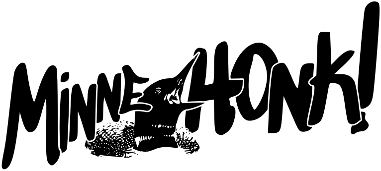

# MinneHONK

## Saturday, May 3 @ GFS

### Festival Lineup

**Say Their Names Cemetery (37th St & Columbus Ave)**
* 12:00 - 1:00: _Opening Ceremony_

**Northern Fist (37th St & Chicago Ave)**
* 1:00 - 1:45: [Kalpulli KetzalCoatlicue](https://www.danzaketzal.com/history)
* 1:45 - 2:30: [Forward! Marching Band](https://fmbwebsite.wixsite.com/forwardmb)
* 2:30 - 3:15: [AFOUTAYI](https://www.afoutayidmaco.com)
* 3:15 - 4:00: [Brass Solidarity](https://brasssolidarity.com/about/)

**People's Way (38th St & Chicago Ave)**
* 1:30 - 2:15: [Unlawful Assembly](http://unlawfulassembly.org)
* 2:15 - 3:00: [Brass Messengers](http://www.brassmessengers.com/about)
* 3:00 - 3:30: [Singing For Liberation](https://bit.ly/tcsongcircles)
* 3:30 - 4:00: _TBD_ <small>(interested artists, email [info@minnehonk.org](mailto:info@minnehonk.org))</small>
* 4:00 - 5:30: _Open Jam Session_: everyone's welcome, so bring an instrument and join, even if you're not coming with a band!

### Getting to George Floyd Square

We encourage you to bus, bike, walk or roll to George Floyd Square if you are able.

* 🚌 George Floyd Square is served most directly by Metro Transit route D. Routes 11, 14, and 23 have stops within a few blocks. (Note that route 23 will be [detoured between Bloomington Ave and Portland Ave](https://www.metrotransit.org/Data/sites/1/media/alert-maps/23-portbloom-269523.png) on May 3, so it won't service the stops nearest to GFS.)
* 🚲 There's a few bike racks and lots of signposts around the neighborhood to lock to. Fences around Say Their Names Cemetery are another good option.
* 🚗 Parking is available on several adjacent streets, but be aware that Chicago Ave between 37th St and 38th St will be closed to motor vehicles, as will westbound traffic on 38th St between Columbus Ave and 10th Ave.

### Pre-Festival Activities

**George Floyd Square Community Cleanup**

Starting at 9am and continuing throughout the day, Rise and Remember will lead a community cleanup and [names will be repainted on the Mourning Passage](https://georgefloydstreetart.omeka.net/items/show/3597). This is in preparation for the [Rise & Remember Festival 2025](https://riseandremember.org/festival/) on May 23-25, memorializing the 5 year angelversary of George Floyd.
More info at [riseandremember.org/events/community-cleanup-day](https://riseandremember.org/events/community-cleanup-day/).

**Slow Roll Bike Ride**

Join the Venture Bikes crew for a relaxed bike tour of south Minneapolis, with a few stops to discuss some people and events in the history of neighborhoods that surround George Floyd Square.
Meetup 8:00-8:30am at Venture Bikes (just below 10th Ave bridge on Midtown Greenway). Ride will end with a free lunch back at Venture Bikes around 11:00am, leaving plenty of time to ride back down to GFS for the MinneHONK! opening ceremony and bands.

### The Five Assumptions of George Floyd Square

1. Assume anyone may have COVID (or some other respiratory disease): mask up or back up.
    * Masks are strongly encouraged for any indoor portions of MinneHONK!

2. Assume someone in this space may be armed: it pays to be polite.
    * If there are any counter-protesters or other disruptive individuals present, act calmly and do what you can to deescalate the situation.
    * Please report any hostile or threatening behavior to the security people on duty.

3. Assume everything you do and everything you say will be recorded, so if you have something to say, say it with your whole chest.
    * There will be photographers and videographers present at MinneHONK!

4. Assume not everyone in this space has your idea of liberation in mind. There are ops everywhere.
    * Trust that most MinneHONK! participants are coming in good faith, but understand that this is not guaranteed.

5. Assume that everyone in this space has experienced pain, grief, trauma, and thwarted expectations, and sometimes things might come out sideways. So let’s be gentle with each other so we can be dangerous together.
    * If you hear something that seems problematic, call that person in rather than calling them out.
    * Treat people at MinneHONK! (and everywhere) with respect and dignity.

### Participation in MinneHONK! is At Your Own Risk

You are attending or participating in MinneHONK! at your own risk and cannot hold anyone, person or organization liable for harm to your person or property.
